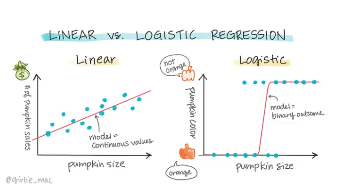

Podstawowa różnica między regresją logistyczną a liniową:

1. **Regresja liniowa**:
   - Używamy jej, gdy przewidujemy **wartości ciągłe**. Na przykład, jeśli chcemy przewidzieć cenę domu na podstawie jego powierzchni, używamy regresji liniowej.
   - Regresja liniowa zakłada, że istnieje **liniowa zależność** między zmienną zależną (którą przewidujemy) a zmiennymi niezależnymi (które wykorzystujemy do przewidywań).

2. **Regresja logistyczna**:
   - Stosujemy ją, gdy nasza zmienna zależna (wynik, który chcemy przewidzieć) jest **dyskretna, zazwyczaj binarna**. Przykład: przewidywanie, czy dana osoba zachoruje (1) czy nie (0) na podstawie czynników takich jak wiek i styl życia.
   - Regresja logistyczna **prognozuje prawdopodobieństwo**, więc wynik będzie liczony jako wartość między 0 a 1, co ułatwia klasyfikację do odpowiednich kategorii.

**Kiedy użyć której?**

- Jeśli przewidywana zmienna jest **ciągła** (np. temperatura, cena), wybieramy regresję **liniową**.
- Jeśli przewidywana zmienna jest **kategoryczna** (np. chory/zdrowy, tak/nie), wybieramy regresję **logistyczną**.

